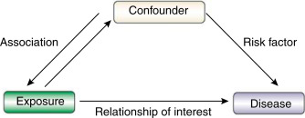

# Glossary

## Mendelian Randomization

**Mendelian Randomization (MR)** is a method scientists use to **figure
out if something actually causes a disease**, rather than just being
linked to it.

In normal studies, we might find that people who drink more sugary
drinks also have a higher risk of heart disease. But is it because of
the sugar? Or is it because they also eat more junk food, don’t
exercise, or have other unhealthy habits?

This is hard to tell because:

-   People’s behaviors are complicated.
-   Other hidden factors (called **confounders**) may be responsible.
-   Sometimes, disease itself may change the behavior (**reverse
    causation**).

MR uses **genetic variants** (which we are born with and can’t change)
as **instrument variables** to act like a **natural experiment**. It’s
like nature’s version of a **randomized controlled trial (RCT)**.

-   Some people are born with genes that make them have naturally higher
    cholesterol.
-   Others have genes that keep it lower.

By comparing the disease risk in these groups, scientists can test
whether **higher cholesterol really causes heart disease**.

Since our genes are decided before birth and are not changed by our
lifestyle, this helps avoid **confounding** and **reverse causation**.

Figure: Mendelian Randomization

[Image
Credit](https://www.researchgate.net/publication/344407603_Causal_association_between_mTOR-dependent_EIF-4E_and_EIF-4A_circulating_protein_levels_and_type_2_diabetes_a_Mendelian_randomization_study/figures?lo=1)

#### In short:

***Mendelian Randomization helps answer: “Does X cause Y?” — using our
genes as unbiased clues***.

------------------------------------------------------------------------

## Pleiotropy

**Pleiotropy** means **a single gene (or genetic variant)** affects
**more than one trait** — like one switch controlling multiple lights.

Figure: Pleiotropy

[Image Credit](https://byjus.com/biology/pleiotropy/)

When using genes to study whether **one thing causes another** (like
cholesterol → heart disease), we assume: \* The gene affects the **risk
factor** (e.g., cholesterol) \* And influences the **disease only
through that risk factor**

But if the gene also affects **other traits**, that **can confuse the
results** — this is **pleiotropy**.

### Two types of pleiotropy:

<table>
<colgroup>
<col style="width: 13%" />
<col style="width: 54%" />
<col style="width: 32%" />
</colgroup>
<thead>
<tr>
<th>Type</th>
<th>What it does</th>
<th>Is it a problem?</th>
</tr>
</thead>
<tbody>
<tr>
<td><strong>Horizontal Pleiotropy</strong></td>
<td>The gene affects the outcome <strong>through a separate
pathway</strong>, <em>not</em> through the main risk factor.</td>
<td>Yes, it <strong>violates assumptions</strong> and can bias MR
results.</td>
</tr>
<tr>
<td><strong>Vertical Pleiotropy</strong></td>
<td>The gene affects the outcome <strong>through the risk
factor</strong> (which may affect other downstream traits).</td>
<td>No, this is <strong>expected and acceptable</strong> in MR.</td>
</tr>
</tbody>
</table>

Figure: Vertical vs Horizontal Pleiotropy

[Image
Credit](https://www.researchgate.net/publication/362846541_An_Overview_of_Methods_and_Exemplars_of_the_Use_of_Mendelian_Randomisation_in_Nutritional_Research/figures?lo=1)

#### Example:

A gene that:

-   Increases cholesterol (**our exposure**)
-   Also directly affects blood pressure (**another pathway**)

That second effect is **horizontal pleiotropy** — and it **breaks the
rules** of Mendelian Randomization.

#### In short:

***Pleiotropy means one gene affects many things. In MR, we worry about
this only if it affects the outcome through a different route than the
one we’re trying to study.***

------------------------------------------------------------------------

## Instrumental Variable (IV)

An **Instrumental Variable (IV)** is like a **helpful middleman** that
scientists use to figure out **whether one thing truly causes another**
— especially when direct observation is messy or confusing.

Suppose we want to know:

**“Does eating more vegetables make people healthier?”**

But people who eat more vegetables might also:

-   Exercise more
-   Be richer
-   Have better access to healthcare

So we can’t tell if health *improves because of the vegetables or
because of everything else*.

An **instrumental variable** is something that:

-   Affects the thing we are interested in (like how many vegetables
    someone eats),
-   Isn’t related to other messy stuff (like income or lifestyle), and
-   Affects the outcome only through that thing (i.e., it affects health
    only because it changes vegetable intake).

### In Mendelian Randomization:

Genetic variants can be great IVs.

For example:

-   Some people are born with a gene that makes them crave bitter foods
    less.
-   Because of this, they might avoid vegetables.
-   That gene doesn’t care about income or exercise—it just affects
    taste.

So we can use that **gene as an IV** to study whether eating more
vegetables truly causes better health.

Figure: Instrument Variable

[Image
Credit](https://yutatoyama.github.io/AppliedEconometrics/instrumental-variable-1-framework.html)

#### In short:

***An Instrumental Variable is a special tool that helps isolate cause
from coincidence—by focusing only on the clean, direct pathway.***

------------------------------------------------------------------------

## Multiple Instruments

**Multiple Instruments** means using **more than one genetic variant**
to answer the same causal question in a Mendelian Randomization (MR)
study.

Let’s say we are trying to find out:

**“Does higher blood pressure cause heart disease?”**

We could use **one gene** that’s known to increase blood pressure.

But… using **only one gene**:

-   May give weak or noisy results, especially if that gene doesn’t
    explain much variation.
-   Could be misleading if that gene affects other things too
    (pleiotropy).

Instead of relying on one gene, we can use **a bunch of genes** that
all:

-   **Influence blood pressure**
-   **Act independently** (not too strongly correlated)
-   Together give a **clearer, stronger signal**

This is like having **many clues** instead of just one, which makes our
conclusion more reliable.

-   Using multiple instruments **increases statistical power** (more
    confident results).

-   It also allows for **sensitivity checks**, like spotting if one gene
    is behaving differently (which could mean it’s not a valid
    instrument).

#### In short:

***Multiple instruments = using many genetic clues to make our causal
answer stronger, more accurate, and more trustworthy.***

------------------------------------------------------------------------

## Allele Score / Genetic Risk Score (GRS)

An **Allele Score** or **Genetic Risk Score (GRS)** is like a **genetic
tally** of how many “risk” versions of genes (called alleles) a person
has for a certain trait — like high cholesterol, obesity, or diabetes.

Imagine each person has **multiple tiny genetic variations** that
slightly affect their blood pressure. Each of these variants contributes
a **small amount**.

A **Genetic Risk Score** simply **adds up**:

-   How many of these “blood pressure–raising” versions someone has.
-   Optionally, **weights** them by how strongly each variant affects
    the trait.

Sometimes, a **single genetic variant** isn’t strong enough to show a
clear connection between a trait (like cholesterol) and a disease (like
heart attack). So, researchers **combine many variants** into one
powerful score — the **GRS** — which becomes a **stronger instrument**.

#### Example:

Let’s say:

-   Gene A increases cholesterol a little
-   Gene B does too
-   Gene C also contributes

If someone has all 3 versions, they’ll have a **higher GRS** → meaning
**genetically higher cholesterol**.

This score helps estimate whether **genetically higher cholesterol
causes heart disease**.

#### In short:

***A Genetic Risk Score is like adding up our “genetic points” for a
trait — and it helps scientists study how that trait might truly cause
disease.***

------------------------------------------------------------------------

## Weak Instrument Bias

**Weak Instrument Bias** happens when the genetic variants (instruments)
used in Mendelian Randomization are **too weakly linked** to the trait
we are studying — like using a blurry lens to look at a problem.

In MR, we use genetic variants to represent a trait (like blood
pressure). But if those variants:

-   **Barely influence** the trait
-   Or only explain **a tiny amount** of variation → They’re called
    **weak instruments**.

When our instruments are weak:

-   The **causal estimate becomes unreliable**
-   The result can be **biased**, especially if our sample size is small
-   The MR can behave more like a **regular observational study**, which
    defeats the purpose!

It’s like trying to measure the weight of an elephant with a **kitchen
scale** — it’s not strong enough, so our reading will be off.

-   Calculate the **F-statistic** — if it’s below **10**, it may
    indicate weak instruments.
-   Use **multiple strong variants** or **allele scores** to boost
    strength.

##### In short:

***Weak Instrument Bias happens when our genetic tools are too weak to
properly represent the trait — leading to wrong or misleading
conclusions.***

------------------------------------------------------------------------

## Confounding

**Confounding** happens when a **third factor** (a “hidden influence”)
affects **both** the thing we are studying (**exposure**) and the
**outcome** — making it **look like they’re related**, even if they’re
not.

Figure: Properties of a confounder

[Image
Credit](https://www.sciencedirect.com/science/article/pii/S0085253815529748)

#### Example:

-   People who carry **lighters** are more likely to get **lung
    cancer**.

Does that mean lighters cause cancer?

**No — the real cause is smoking**.

Smoking causes both:

-   Carrying a lighter (exposure)
-   Lung cancer (outcome)

So **smoking** is the **confounder**.

In Mendelian Randomization we worry that:

-   In normal studies, confounders (like diet, income, stress) might
    **make it look like** a risk factor (like cholesterol) causes
    disease — even if it doesn’t.

MR uses **genetic variants** because they’re:

-   **Fixed from birth**
-   **Not influenced by lifestyle or environment**

→ So they’re **less likely to be affected by confounding**.

#### In short:

***Confounding is when a hidden factor tricks us into thinking two
things are related. MR helps avoid this by using genes that aren’t
affected by those hidden influences.***

------------------------------------------------------------------------

## Reverse Causation

**Reverse causation** is when we **get the direction of cause and effect
wrong** — we think **A causes B**, but actually **B causes A**.

Figure: Reverse Causation

[Image
Credit](https://nap.nationalacademies.org/read/11908/chapter/10#157)

#### Example:

We see that:

-   People who take painkillers often have headaches.

Does that mean **painkillers cause headaches**?

No! It’s the other way around — **headaches cause people to take
painkillers**. That’s **reverse causation**.

#### In Health Studies:

Let’s say we observe that people with low physical activity tend to have
heart disease. But maybe they **became less active because of the
disease**, not the other way around.

So it’s hard to tell which came first — the **risk factor** or the
**disease**.

Genes are **fixed at birth** and can’t be changed by disease.

So if a gene leads to higher BMI, and people with that gene have more
diabetes, we can be more confident that:

> Higher BMI → causes → diabetes, and not the other way around.

#### In short:

***Reverse causation is when the disease actually causes the risk factor
— not vice versa. MR avoids this by using genes, which can’t be changed
by disease.***

------------------------------------------------------------------------

## Causal Effect Estimate

The **Causal Effect Estimate** in Mendelian Randomization (MR) tells us
**how much changing a risk factor actually changes the risk of disease**
— based on genetic evidence.

#### Example:

Let’s say we want to know:

> “If body weight (BMI) increases, how much does the risk of diabetes go
> up?”

Using MR, we might find:

> **Each 1 unit increase in genetically predicted BMI increases diabetes
> risk by 20%.**

That 20% is our **causal effect estimate** — it tells we how strong the
cause-and-effect link is between BMI and diabetes.

#### How is it calculated?

-   For **one genetic variant**, the causal effect is often calculated
    using the **Wald ratio**:

> Effect of gene on disease ÷ Effect of gene on trait

-   For **multiple variants**, we combine all estimates using methods
    like:

-   **Inverse-Variance Weighted (IVW)**

-   **MR-Egger**

-   **Weighted median**

These give us a **final causal number** (e.g., odds ratio or beta) that
answers:

> “If we could increase/decrease the trait (like cholesterol), what
> would happen to disease risk?”

#### In short:

***A Causal Effect Estimate tells us how much a trait (like blood
pressure) truly affects a disease (like stroke) — using genes as natural
proof of cause.***

------------------------------------------------------------------------

## Wald Ratio

The **Wald Ratio** is the **simplest method** used in Mendelian
Randomization (MR) to estimate the **causal effect** of a trait on a
disease when using **just one genetic variant** as the instrument.

Imagine we have a gene that:

-   Increases **blood pressure** by 2 units (exposure)
-   Increases the risk of **heart disease** by 10% (outcome)

The Wald Ratio helps us answer:

> “How much does 1 unit increase in blood pressure cause heart disease
> risk to go up?”

$$
\Large \text{Wald Ratio} = \frac{\text{Effect of genetic variant on outcome}}{\text{Effect of genetic variant on outcome}}
$$

Or in words:

> **Causal Effect = Outcome Change ÷ Exposure Change**

#### Example

-   Gene increases **BMI** by **0.5 units**
-   Same gene increases **diabetes risk** by **0.2 (log odds)**

$$
\large = \text{Wald Ratio} = \frac{0.2}{0.5} = 0.4
$$

So, the causal effect estimate = **0.4** increase in diabetes risk **per
unit BMI**.

#### Notes:

-   Only valid if the gene is a **valid instrument** (meets MR
    assumptions).
-   For **multiple variants**, we use other methods (like IVW), not the
    Wald Ratio.

#### In short:

***The Wald Ratio is a simple formula that tells us how much a trait
affects disease by dividing how much a gene affects the disease by how
much it affects the trait.***

------------------------------------------------------------------------

## Clumping / LD Pruning

**Clumping** (also called **LD Pruning**) is a step used in Mendelian
Randomization (MR) to make sure we’re using **independent genetic
variants** — not ones that are **closely related** or **linked**.

In our genome, some genetic variants (SNPs) are **inherited together**
because they sit close to each other. This is called **linkage
disequilibrium (LD).**

If we use multiple SNPs that are in LD: \* We are **double-counting**
the same genetic signal. \* It can **inflate our results** and make them
**misleading**.

Imagine we ask 10 friends the same question, but 5 of them **copy each
other’s answers**. We are not getting 10 opinions — just **6 real ones**
and **4 duplicates**.

Clumping/LD pruning helps us:

> **Remove those duplicates** so our analysis is fair and unbiased.

Clumping keeps:

-   The **strongest SNP** in a region (based on its p-value or effect
    size)
-   And **removes nearby SNPs** that are **too correlated** (above a
    chosen LD threshold like r² &gt; 0.1)

#### Tools that do clumping:

-   PLINK
-   TwoSampleMR R package
-   LDlink / MR-Base

#### In short:

***Clumping (LD pruning) is like cleaning our SNP list — it keeps only
the strongest, independent genetic signals and throws out the ones that
are too closely related.***

------------------------------------------------------------------------

## Bidirectional Mendelian Randomization

**Bidirectional Mendelian Randomization** is a method used to **check
the direction of causality** between two traits — to find out **which
one causes the other**, or if it might **go both ways**.

#### Example:

We find that:

-   **Depression** is linked to **obesity**.

But which comes first?

-   Does **obesity cause depression**?
-   Or does **depression lead to obesity**?
-   Or maybe **both**?

### How Bidirectional MR helps:

We run two separate MR analyses:

-   **1.** Use genetic variants related to **obesity** to test if it
    causes **depression**.
-   **2** Use genetic variants related to **depression** to test if it
    causes **obesity**.

By comparing both results, we can see which direction (or both) is
**more likely to be causal**.

### Why is this useful?

It helps prevent wrong conclusions.

In observational studies, strong associations don’t tell us which way
the effect flows.

Bidirectional MR lets us test:

> “Is X causing Y, or is Y causing X — or both?”

#### In short:

***Bidirectional MR is like flipping the question to both sides — to
find out whether Trait A causes Trait B, or Trait B causes Trait A — or
if they influence each other.***

------------------------------------------------------------------------

## Balanced Pleiotropy

Balanced pleiotropy happens when some genetic variants used in Mendelian
Randomization (MR) have **pleiotropic effects** (i.e., they influence
the outcome through other pathways), but **these effects cancel each
other out on average**.

Imagine we are trying to measure the height of a tree using different
measuring tapes. Some tapes are a little **too long**, some are **too
short**, but if the errors **average out to zero**\*, we still get a
**fair estimate**.

That’s **balanced pleiotropy**.

### Why is it important in MR?

-   **Pleiotropy** can violate the MR assumption that genetic variants
    affect the outcome **only through the exposure**.

-   But if the pleiotropic effects are **random** (some push the result
    up, others pull it down), and **average out**, we call it
    **balanced**.

In this case:

-   Methods like **Inverse-Variance Weighted (IVW)** can still give
    **unbiased causal estimates**.

### What’s the risk?

If pleiotropy is **not balanced** (i.e., mostly in one direction), it’s
called **directional pleiotropy** — and that **can bias our MR
results**.

### How to check?

-   Use methods like **MR-Egger regression** — which tests for
    **unbalanced pleiotropy**.
-   If the **intercept ≠ 0**, it suggests directional (problematic)
    pleiotropy.

#### In short:

***Balanced pleiotropy means genetic variants may have other effects,
but those effects cancel each other out — so the MR estimate can still
be trusted.***

------------------------------------------------------------------------

## F-statistic

The **F-statistic** is a number that tells us **how strong our genetic
instrument** is in Mendelian Randomization (MR). It helps answer the
question:

> “Is the genetic variant really doing a good job representing the risk
> factor?”

### Genetic variants as thermometers for BMI

Imagine we are trying to **measure someone’s BMI** (body mass index),
but instead of using a scale and height chart, we are using a **genetic
variant** — a kind of **“genetic thermometer”**.

-   If the variant is **strongly related to BMI**, it acts like a
    **high-quality thermometer** — it clearly shows higher BMI when the
    variant is present.

-   If the variant is **weakly related to BMI**, it’s like using a
    **faulty thermometer** — it barely changes the reading, even if BMI
    changes a lot.

### In MR:

We want genetic variants that are strongly associated with the exposure
(risk factor). The F-statistic helps test this.

#### Rule of Thumb:

-   **F &gt; 10** → Strong instrument → Safe to use in MR
-   **F &lt; 10** → Weak instrument → Can lead to **biased or
    unreliable** causal estimates (i.e., weak instrument bias)

#### How it’s calculated

It depends on:

-   How strongly the variant explains the **variation in the exposure**
-   The sample size of **the study**

In software like PLINK or regression models, it’s often provided
automatically.

#### In short:

***The F-statistic tells us how strong our genetic instrument is. If
it’s too low (below 10), our MR results might not be reliable.***

------------------------------------------------------------------------

### Common MR Tools / Platforms

<table>
<colgroup>
<col style="width: 18%" />
<col style="width: 81%" />
</colgroup>
<thead>
<tr>
<th>Tool</th>
<th>Purpose</th>
</tr>
</thead>
<tbody>
<tr>
<td><strong>TwoSampleMR (R package)</strong></td>
<td>A widely used package for performing two-sample MR, includes
harmonization, analysis, and sensitivity tests.</td>
</tr>
<tr>
<td><strong>MR-Base</strong></td>
<td>A platform and database that connects to TwoSampleMR, offering
<strong>thousands of GWAS summary datasets</strong> for MR
analysis.</td>
</tr>
<tr>
<td><strong>MR-PRESSO</strong></td>
<td>Detects and corrects for <strong>pleiotropic outliers</strong>.</td>
</tr>
<tr>
<td><strong>GSMR (GCTA software)</strong></td>
<td>Generalized Summary-data-based MR, allows MR with LD correction and
multiple exposures.</td>
</tr>
</tbody>
</table>

### MR Assumptions

<table>
<colgroup>
<col style="width: 23%" />
<col style="width: 76%" />
</colgroup>
<thead>
<tr>
<th>Assumption</th>
<th>Meaning</th>
</tr>
</thead>
<tbody>
<tr>
<td><strong>Relevance</strong></td>
<td>Genetic variant is associated with the exposure.</td>
</tr>
<tr>
<td><strong>Independence</strong></td>
<td>Variant is not associated with confounders.</td>
</tr>
<tr>
<td><strong>Exclusion Restriction</strong></td>
<td>Variant affects the outcome only through the exposure (no horizontal
pleiotropy).</td>
</tr>
</tbody>
</table>

#### References

-   Davey Smith, G., & Hemani, G. (2014). Mendelian randomization:
    Genetic anchors for causal inference in epidemiological studies.
    Human Molecular Genetics, 23(R1), R89–R98.
    <https://doi.org/10.1093/hmg/ddu328>

-   Burgess, S., & Thompson, S. G. (2015). Mendelian Randomization:
    Methods for Using Genetic Variants in Causal Estimation. Chapman and
    Hall/CRC Press. (Book – foundational MR statistical methods and
    glossary terms)

-   Lawlor, D. A., Harbord, R. M., Sterne, J. A. C., Timpson, N., &
    Davey Smith, G. (2008). Mendelian randomization: Using genes as
    instruments for making causal inferences in epidemiology. Statistics
    in Medicine, 27(8), 1133–1163. <https://doi.org/10.1002/sim.3034>

-   Hemani, G., Tilling, K., & Davey Smith, G. (2017). Orienting the
    causal relationship between imprecisely measured traits using GWAS
    summary data. PLoS Genetics, 13(11), e1007081.
    <https://doi.org/10.1371/journal.pgen.1007081>

-   Bowden, J., Davey Smith, G., & Burgess, S. (2015). Mendelian
    randomization with invalid instruments: Effect estimation and bias
    detection through Egger regression. International Journal of
    Epidemiology, 44(2), 512–525. <https://doi.org/10.1093/ije/dyv080>

-   Verbanck, M., Chen, C. Y., Neale, B., & Do, R. (2018). Detection of
    widespread horizontal pleiotropy in causal relationships inferred
    from Mendelian randomization between complex traits and diseases.
    Nature Genetics, 50(5), 693–698.
    <https://doi.org/10.1038/s41588-018-0099-7> (MR-PRESSO method and
    pleiotropy detection)

-   Sanderson, E., Davey Smith, G., Windmeijer, F., & Bowden, J. (2019).
    An examination of multivariable Mendelian randomization in the
    single-sample and two-sample summary data settings. International
    Journal of Epidemiology, 48(3), 713–727.
    <https://doi.org/10.1093/ije/dyy262>

-   Palmer, T. M., Lawlor, D. A., Harbord, R. M., Sheehan, N. A.,
    Tobias, J. H., Timpson, N. J., et al. (2012). Using multiple genetic
    variants as instrumental variables for modifiable risk factors.
    Statistical Methods in Medical Research, 21(3), 223–242.
    <https://doi.org/10.1177/0962280210394459>

-   Brion, M.-J. A., Shakhbazov, K., & Visscher, P. M. (2013).
    Calculating statistical power in Mendelian randomization studies.
    International Journal of Epidemiology, 42(5), 1497–1501.
    <https://doi.org/10.1093/ije/dyt179>

-   Davies, N. M., Holmes, M. V., & Davey Smith, G. (2018). Reading
    Mendelian randomisation studies: A guide, glossary, and checklist
    for clinicians. BMJ, 362, k601. <https://doi.org/10.1136/bmj.k601>
