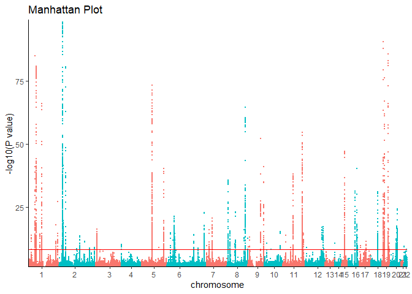
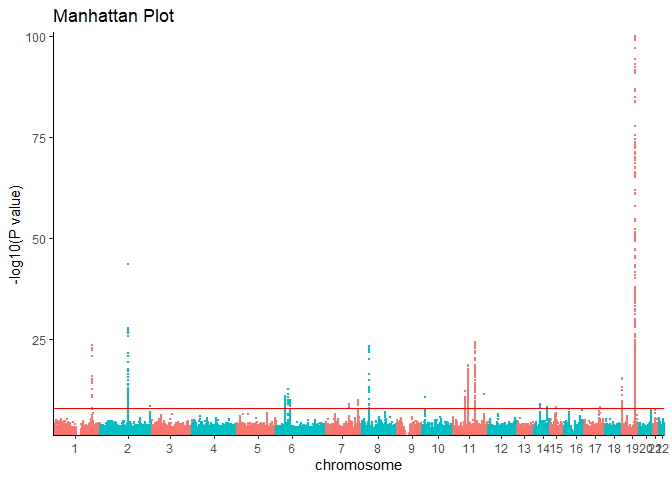

# Phenotypes

The following genome-wide association studies (GWAS) are used as example
traits for each of the MR methods covered in this tutorial.

#### Load R packages

    library(tidyverse)    # Data wrangling 

    ## ── Attaching core tidyverse packages ──────────────────────── tidyverse 2.0.0 ──
    ## ✔ dplyr     1.1.4     ✔ readr     2.1.5
    ## ✔ forcats   1.0.0     ✔ stringr   1.5.1
    ## ✔ ggplot2   3.5.2     ✔ tibble    3.2.1
    ## ✔ lubridate 1.9.4     ✔ tidyr     1.3.1
    ## ✔ purrr     1.0.4     
    ## ── Conflicts ────────────────────────────────────────── tidyverse_conflicts() ──
    ## ✖ dplyr::filter() masks stats::filter()
    ## ✖ dplyr::lag()    masks stats::lag()
    ## ℹ Use the conflicted package (<http://conflicted.r-lib.org/>) to force all conflicts to become errors

    library(TwoSampleMR)  # MR 

    ## TwoSampleMR version 0.6.19 
    ## 
    ##   [>] New authentication requirements: https://mrcieu.github.io/ieugwasr/articles/guide.html#authentication.
    ##   [>] Major upgrades to our servers completed to improve service and stability.
    ##   [>] We need your help to shape our emerging roadmap!
    ##       Please take 2 minutes to give us feedback -
    ##       https://forms.office.com/e/eSr7EFAfCG

    library(ggman)

    ## Loading required package: ggrepel

    # Define column types for summary statistics
    coltypes = cols(
      ID = col_character(),
      CHROM = col_double(),
      POS = col_double(),
      REF = col_character(),
      ALT = col_character(),
      AF = col_double(),
      TRAIT = col_character(),
      BETA = col_double(),
      SE = col_double(),
      Z = col_double(),
      P = col_double(),
      N = col_double(),
      OR = col_double(),
      OR_L95 = col_double(),
      OR_U95 = col_double(),
      DIR = col_character(),
      G1000_ID = col_character(),
      G1000_VARIANT = col_character(),
      DBSNP_ID = col_character(),
      DBSNP_VARIANT = col_character(),
      OLD_ID = col_character(),
      OLD_VARIANT = col_character()
    )

## Lipids

A GWAS of low-density lipoprotein (LDL) cholesterol, high-density
lipoprotein (HDL) cholesterol, triglycerides and total cholesterol
levels conducted in 188,577 individuals that identified 157 loci were
associated with lipid levels.

Willer, C. J. et al. Discovery and refinement of loci associated with
lipid levels. Nat Genet 45, 1274–83 (2013).

    tc_path = "F:/Github Classes/MR/Mendelian-Randomization/chapters/DATA/Willer2013tc.chrall.CPRA_b37.tsv.gz"
    tc_ss <- read_tsv(tc_path, comment = "##", col_types = coltypes, 
                            col_select = c(DBSNP_ID, CHROM, POS, REF, ALT, AF, BETA, SE, Z, P, N, TRAIT))

    # Filter on p < 0.5 to reduce compute
    ggman(filter(tc_ss, P < 0.05 & P > 1e-100), snp = "DBSNP_ID", bp = "POS", chrom = "CHROM", pvalue = "P", relative.positions = TRUE) + 
      theme_classic()

## Alzheimer’s disease

A GWAS of Alzheimer’s disease conducted in 94,437 indivudles by the
International Genomics Alzheiemr’s Project that Identified 20
genome-wide significant loci.

Kunkle, B. W. et al. Genetic meta-analysis of diagnosed Alzheimer’s
disease identifies new risk loci and implicates Aβ, tau, immunity and
lipid processing. Nat Genet 51, 414–430 (2019).

    AD_path = "F:/Github Classes/MR/Mendelian-Randomization/chapters/DATA/Kunkle2019load_stage123.chrall.CPRA_b37.tsv.gz"
    AD_ss <- read_tsv(AD_path, comment = "##",  col_types = coltypes, 
                           col_select = c(DBSNP_ID, CHROM, POS, REF, ALT, AF, BETA, SE, Z, P, N, TRAIT))

    # Filter on p < 0.5 to reduce compute
    ggman(filter(AD_ss, P < 0.05 & P > 1e-100), snp = "DBSNP_ID", bp = "POS", chrom = "CHROM", pvalue = "P", relative.positions = TRUE) + 
      theme_classic()

