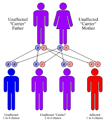
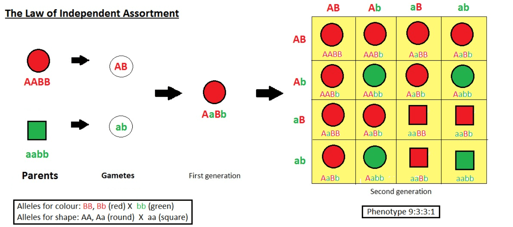
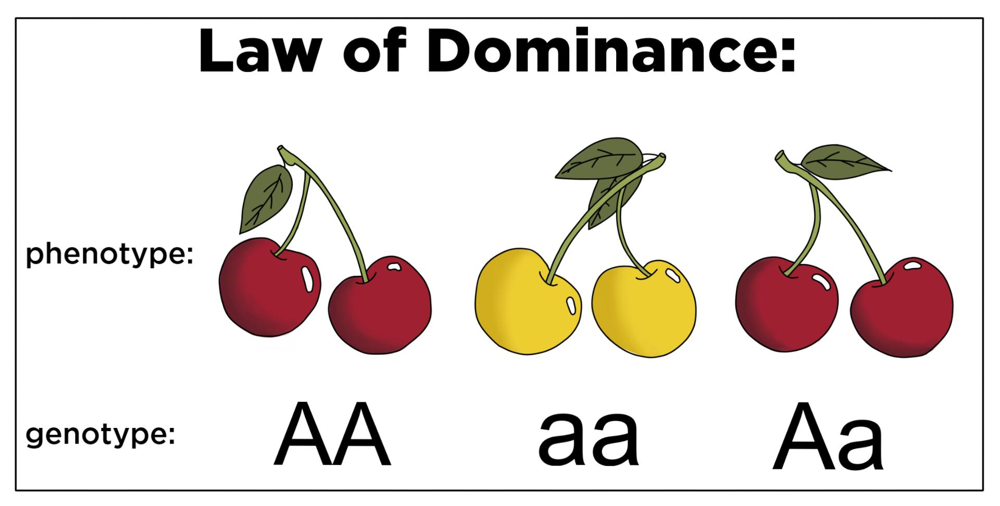

# Mendel’s Laws

Mendelian Randomization uses Mendel’s **law of segregation** and **law
of independent assortment**.

**Gregor Mendel** was a monk and scientist who experimented with **pea
plants** in the 1800s. He is known as the **Father of Genetics** because
he discovered the basic rules of how traits (like height or eye color)
are passed from **parents to offspring**.

He studied **traits** like:

-   Tall vs. Short plants
-   Green peas vs. Yellow peas
-   Round peas vs. Wrinkled peas

He cross-bred plants and kept careful records to figure out how traits
are inherited.

## Mendel’s Laws of Inheritance

Gregor Mendel formulated three fundamental **laws of inheritance** based
on his experiments with pea plants. These laws describe how traits are
passed from parents to offspring.

### 1. Law of Segregation

-   **Definition**:
    -   Each individual has two alleles for each gene, and these alleles
        segregate (separate) randomly during gamete formation, so that
        each gamete receives only one allele.
-   **Explanation**:
    -   Organisms inherit two copies of each gene (one from each
        parent).
    -   During meiosis (gamete formation), the two alleles segregate
        randomly, ensuring that each gamete carries only one allele for
        each gene.
    -   Fertilization restores the diploid state, with offspring
        receiving one allele from each parent.

#### Example:

Let’s say “T” is the gene for **Tall** and “t” is for **Short**.

-   A plant with **Tt** has one **Tall** gene and one **Short** gene.
-   Even though it’s tall (because T is stronger), it can pass **either
    T** or t to its children—**not both**.

So, every time it reproduces, it passes only **one** of its two alleles.

Figure 1: Law of Segregation

[Image Credit](https://www.pathwayz.org/Tree/Plain/LAW+OF+SEGREGATION)

Imagine your mom gives you one shoe, and your dad gives you one shoe.
You now have a pair. But when you grow up and have kids, you randomly
give one of those shoes to your child.

### 2. Law of Independent Assortment

-   **Definition**:
    -   Genes for different traits assort independently of one another
        during gamete formation, given that the genes are located on
        different chromosomes.
-   **Explanation**:
    -   When genes are located on different chromosomes, the inheritance
        of one trait does not influence the inheritance of another.

    -   This leads to genetic variation in offspring.

#### Example:

Let’s say pea shape (Round vs Wrinkled) and color (Yellow vs Green) are
two traits.

-   A plant with **Round + Yellow** can produce kids with combinations
    like:

    -   Round + Green
    -   Wrinkled + Yellow
    -   Round + Yellow
    -   Wrinkled + Green

The **shape** gene doesn’t affect how the **color** gene is passed on.
They assort independently.

    * **A cross between RrYy × RrYy** will produce offspring with various combinations of these traits in a 9:3:3:1 ratio.

Figure 2: Law of Independent Assortment

[Image
Credit](https://www.careerpower.in/school/biology/law-of-independent-assortment-definition-and-examples)

Imagine you’re packing a lunchbox. The sandwich type (veg or chicken)
and the drink (juice or soda) are chosen independently. Just because you
get a veg sandwich doesn’t mean you must get juice—you could get any
drink.

#### 3. Law of Dominance

-   **Definition**:
    -   When two different alleles for a trait are present in an
        organism, one allele may dominate over the other, masking its
        effect.
-   **Explanation**:
    -   The dominant allele is expressed in the phenotype, while the
        recessive allele remains hidden unless an organism has two
        copies of it.

    -   This explains why some traits disappear in one generation but
        reappear in the next.

#### Example:

-   T = Tall (dominant),
-   t = Short (recessive)

If a plant has genes **Tt**, it will **look tall** because T is dominant
and **hides** the short gene (t).

You won’t see the shortness unless the plant has **tt**.

Figure 3: Law of Dominance

[Image
Credit](https://www.expii.com/t/law-of-dominance-definition-role-10971)

These laws form the foundation of classical genetics, although modern
genetics has shown exceptions (e.g., linked genes, incomplete dominance,
and polygenic traits)’

Imagine you mix chocolate syrup (dominant) and milk (recessive). The
drink tastes mostly like chocolate. The chocolate flavor dominates, even
though milk is still there.

#### Summary Table

<table>
<colgroup>
<col style="width: 12%" />
<col style="width: 33%" />
<col style="width: 54%" />
</colgroup>
<thead>
<tr>
<th>Genotype</th>
<th>Appearance (Phenotype)</th>
<th>Explanation</th>
</tr>
</thead>
<tbody>
<tr>
<td>TT</td>
<td>Tall</td>
<td>Two tall genes</td>
</tr>
<tr>
<td>Tt</td>
<td>Tall</td>
<td>One tall, one short – tall dominates</td>
</tr>
<tr>
<td>tt</td>
<td>Short</td>
<td>No tall gene present</td>
</tr>
</tbody>
</table>

### Fun Punnett Square Example:

Let’s say two Tt (Tall) plants are crossed:

<table>
<thead>
<tr>
<th></th>
<th>T (Dad)</th>
<th>t (Dad)</th>
</tr>
</thead>
<tbody>
<tr>
<td>T (Mom)</td>
<td>TT</td>
<td>Tt</td>
</tr>
<tr>
<td>t (Mom)</td>
<td>Tt</td>
<td>tt</td>
</tr>
</tbody>
</table>

-   TT = Tall
-   Tt = Tall
-   Tt = Tall
-   tt = Short

So, **3 out of 4** are tall, and **1 out of 4** is short.

Mendel’s laws are the foundation of how we understand **heredity**.
These simple ideas explain why:

-   You might have your dad’s nose but your mom’s eyes.
-   Some diseases “run in the family.”
-   Siblings can look very different from each other!

#### References

-   Klug, W. S., Cummings, M. R., Spencer, C. A., & Palladino, M. A.
    (2016). Concepts of Genetics (11th ed.). Pearson Education.

-   Griffiths, A. J. F., Wessler, S. R., Carroll, S. B., & Doebley, J.
    (2020). Introduction to Genetic Analysis (12th ed.). W.H. Freeman
    and Company. (A modern interpretation of Mendelian principles in
    classical and molecular contexts)

-   Pierce, B. A. (2017). Genetics: A Conceptual Approach (6th ed.).
    W.H. Freeman. (Great for undergraduate teaching and Mendelian
    examples)

-   Hartl, D. L., & Ruvolo, M. (2011). Genetics: Analysis of Genes and
    Genomes (8th ed.). Jones & Bartlett Learning. (Detailed history and
    modern applications of Mendel’s work)

-   Falk, R. (1995). The Gene: A Concept in Tension. University of
    Chicago Press.

-   Olby, R. (1985). Origins of Mendelism (2nd ed.). University of
    Chicago Press.
