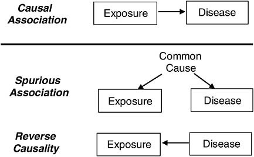

# Mendelian Randomization

## 1. Introduction
**Mendelian Randomization (MR)** is an analytical approach that leverages genetic variants as **instrumental variables** to **infer causal relationship between exposure (e.g., lifestyle factor or biomarker) and an outcome (e.g., disease risk)**. If there is a cusal relationship between two variables it also **estimate magnitude of causal effect**. MR is based on the principle that genetic variants are randomlly allocated at conception and are thus **less likely to influenced by confounding factors** or **reverse causation**, which are common issues in observationals studies.

```{r echo=FALSE, fig.align = "center", fig.cap = "Figure 1: Reverse Causation"}

```

[Image Credit](https://nap.nationalacademies.org/read/11908/chapter/10#157)