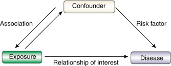

# Mendelian Randomization

## 1. Introduction

**Mendelian Randomization (MR)** is an analytical approach that
leverages genetic variants as **instrumental variables** to **infer
causal relationship between exposure (e.g., lifestyle factor or
biomarker) and an outcome (e.g., disease risk)**. If there is a causal
relationship between two variables it also **estimate magnitude of
causal effect**. MR is based on the principle that genetic variants are
randomly allocated at conception and are thus **less likely to
influenced by confounding factors** or **reverse causation**, which are
common issues in observational studies.

Figure 1: Reverse Causation

[Image
Credit](https://nap.nationalacademies.org/read/11908/chapter/10#157)

By using genetic instruments, MR provides an approach to estimate causal
effects in a manner analogus to **randomized clinical trials** (RCTs),
offering valuable insights into public health and biomedical research.

Figure 2: Similarities between Mendelian Randomization and Randomized
Clinical Trial

[Image
Credit](https://cloufield.github.io/GWASTutorial/16_mendelian_randomization/)

### Randomized Controlled Trials (RCTs):

-   Not always practically feasible or ethical. For example: anything
    toxis

-   Expensive, requires experimentation in humans

-   Impractical for long follow up times

-   Should only be conducted on interventions that show very strong
    observational evidence in humans.

### Observational Studies

-   Association between environmental exposures and diseases measured in
    observational design (non-experimental). For example: case-control
    studies or cohort studies

-   Reliably assigning causality in these types of studies is **very
    limited**.

## 2. Key assumptions

### 1. Relevance

-   The genetic variants used as instruments must be strongly associated
    with the exposure of interest (e.g., a biomarker, lifestyle
    factors).

-   This assumption ensures that the selected genetic variants influence
    the exposure significantly.

-   Assessed using metrics such as F-statistics (values &gt; 10 indicate
    strong instrument strength).

### 2. Independence (no confounding) assumption

-   The genetic variants must not be associated with confounders that
    affect both the exposure and the outcome.

-   Since genotypes are assigned randomly during conception, this
    assumption aims to minimize confounding.

Figure 3: Properties of a confounder

[Image
Credit](https://www.sciencedirect.com/science/article/pii/S0085253815529748)

### 3. Exclusion Restriction Assumption

-   The genetic variants must influence the outcome only through
    exposure and not through alternative pathways (i.e. **no
    pleiotropy**). Violations of this assumption can bias MR results.

Figure 4: Mendelian randomization concept and assumptions.

[Image
Credit](https://ars.els-cdn.com/content/image/1-s2.0-S0753332222003419-gr1_lrg.jpg)

## 3. Types of Mendelian Randomization Analyses

### 1. One-sample Medelian Randomization

-   Utilized individual-level data where genetic variants, exposures,
    and outcomes are measured within the same dataset.    
-   Methods often used include:
    -   **Two-Stage Least Squares (2SLS)**: First, exposure is predicted
        using genetic variants; second, the outcome is regressed on the
        predicted exposure.
    -   Limited power in small sample sizes.

### 2. Two-Sample Mendelian Randomization

-   Uses summary-level statistics from two independent GWAS: one for
    exposure and another for the outcome.    
-   Allows for larger sample sizes and increased statistical power.  
     
-   Common tools: **MR-Base**, **TwoSampleMR (R package)**.

## 4. Mendelian Randomization Methods

Several statistical methods have been developed to account for
pleiotropy and other biases in MR:

### 1. Inverese-Variance Weighted (IVW) Regression

-   A commonly used approach that combines the effect estimates from
    multiple genetic instruments using a weighted regression model.  
     
-   Assumes no directional pleiotropy.    
-   Provides an overall causal estimate.

### 2. MR-Egger Regression

-   Allows for the **presence of pleiotropy** by modelling the intercept
    to test for bias.    
-   If the intercept deviates from zero, it indicates potential
    pleiotropy.

### 3. Weighted Median Estimator

-   Provides a robust estimate by taking the median of individual
    instrument effects.    
-   Robust to invalid instruments as long as at least 50% of the genetic
    variants are valid instruments.

### 4. Mode-Based Estimator

-   Clusters similar effect estimates and identifies the most frequent
    value.    
-   Assumes a majority of the instruments are valid.

### 5. MR-PRESSO (Pleiotropy Residual Sum and Outlier Test)

-   Detects and corrects for horizontal pleiotropy by removing outliers.

### 6. Multivariable MR (MVMR)

-   Accounts for multiple exposures to estimate the direct causal effect
    of an exposure on an outcome while adjusting for potential
    confounders.

## 5. Application of Mendelian Randomization

MR has been widely used in epidemiology, public health, and medical
research, including:

### 1. Cardiovascular Disease (CVD):

-   Causal effects of LDL, cholesterol, blood pressure, and obesity on
    CVD risk.

### 2. Cancer Risk:

-   Investigating the causal effect of lifestyle factors such as
    smoking, alcohol consumption, and BMI on cancer incidence.

### 3. Psychiatric and Neurological Disorders:

-   Assesing the causal effects of vitamin D levels, sleep patterns, or
    BMI on depression, schizophrenia, and Alzheimer’s disease.

### 4. Metabolic Disorders:

-   Determine the causal role of insulin resistance, adiposity, and
    liver enzymes in type 2 diabetes.

## 6. Advantages of Mendelian Randomization

-   **Reduction of Confounding Bias**: Since genotypes are randomly
    assigned at conception, they are independent of environmental
    confounders.    
-   **Prevention of Reverse Causality** Genetics variants are fixed
    before disease onset, reducing the likelihood of reverse causation.
       
-   **Efficient and Cost-Effective** Utilizes existing genetic data from
    large-scale consortia, eliminating the need for expensive clinical
    trials.

## 7. Challenges and Limitations of Mendelian Randomization

Despite its advantages, MR has several limitations:

### 1. Pleiotropy:

-   A major concern where genetic variants influence the outcome through
    multiple pathways, violating the exclusion restriction assumption.
       
-   Methods like MR-Egger and MR-PRESSO attempt to address pleiotropy.

### 2. Weak Instrument Bias:

-   If genetic variants explain only a small proportion of variance in
    the exposure, the results may be biased.    
-   Ensuring a high F-statistic helps mitigate weak instrument bias.

### 3. Population Stratification:

-   Differences in genetic ancestry may confound associations.    
-   Conducting MR within homogenous populations and adjusting for
    principal components can address this issue.

### 4. Selection Bias:

-   Selection of study participants (e.g., biobanks) can lead to bias if
    genetic associations differ across populations.

## 8. Tools and Software for Mendelian Randomization

Several tools have been developed to perform MR analyses:

### 1. MR-Base (R package)

-   Provides a comprehensive database of GWAS summary statistics and
    allows for two-sample MR analysis.    
-   Offers methods such as IVW, MR-Egger, and weighted median.

### 2. TwoSampleMR (R package)

-   A widely used package that facilitates data extraction and MR
    analysis using multiple methods.

### 3. MendelianRandomization (R package)

-   Provides functions for performing various MR methods, including
    sensitivity analyses.

### 4. SMR (Summary-based Mendelian Randomization)

Integrates GWAS and eQTL data to identify functional relationships
between SNPs, gene expression, and phenotypic traits.

## 9. Future Directions in Mendelian Randomization

### 1. MR in Diverse Populations:

-   Expanding studies to non-European populations to improve
    generalizability.

### 2. MR using Single-Cell Data:

-   Leveraging single-cell genomics to understand cell-type-specific
    causal relationships.

### 3. Multi-Omics MR:

-   Integrating genomics, epigenomics, and proteomics data for a
    holistic understanding of causal pathways.

### 4. Machine Learning and MR:

-   Application of AI/ML approaches to improve instrument selection and
    causal inference.

## 10. Conclusion

Mendelian Randomization is a powerful approach for inferring causality
between exposures and health outcomes using genetic data. With
increasing availability of large-scale genomic data, MR continues to
provide critical insights into disease etiology and public health
interventions. However, careful consideration of its assumptions and
potential biases is essential to ensure reliable and interpretable
results.

## Key References

1.  Davies, N. M., Holmes, M. V., & Davey Smith, G. (2018). Reading
    Mendelian randomization studies: A guide, glossary, and checklist
    for clinicians. BMJ, 362, k601.
2.  Bowden, J., Davey Smith, G., & Burgess, S. (2015). Mendelian
    randomization with invalid instruments: Effect estimation and bias
    detection through Egger regression. International Journal of
    Epidemiology, 44(2), 512-525
3.  Hartwig, F. P., Davey Smith, G., & Bowden, J. (2017). Robust
    inference in summary data Mendelian randomization via the zero modal
    pleiotropy assumption. International Journal of Epidemiology, 46(6),
    1985-1998.
